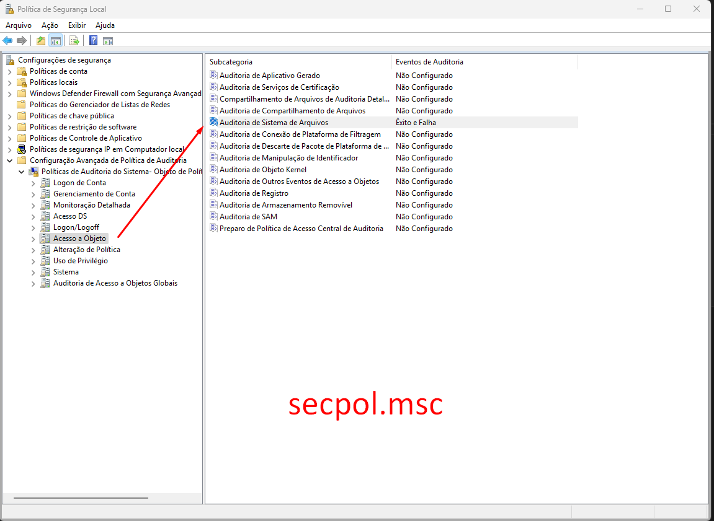

# Honey5kr1pt 🐝💾

<div align="center">

</div>

Honeypot simples e objetivo para servidores de arquivos Windows/SMB.  
Ele cria um **arquivo-isca** e registra, em tempo real, cada tentativa de leitura — informando **usuário** e **IP** de origem.

---

## ✨ Principais recursos

| Recurso | Detalhes |
|---------|----------|
| **Arquivo-isca configurável** | Nome, subpasta e tamanho definidos na execução. |
| **Auditoria via SACL** | Ativa auditoria NTFS (GENERIC_READ) somente no arquivo-isca. |
| **Correlação 4663 ⇆ 4624** | Exibe IP remoto do usuário que acessou o arquivo. |
| **Filtro inteligente** | Ignora contas de computador ( `PC-NAME$` ) e eventos anteriores ao start. |
| **Log duplo** | Console + arquivo `honey5kr1pt.log`. |
| **Sem dependências pesadas** | Apenas `pywin32`; roda como script único ou pacote. |

---

## ⚡ Pré-requisitos

* **Windows Server / Windows 10+** (onde está o share).
* **Python ≥ 3.9**  
```powershell
winget install Python.Python.3.10
```
* **pywin32**  
```powershell
pip install pywin32
```
- Executar o script **como Administrador de dominio ou conta no AD com administrador de domínio** (para aplicar SACL).
    
- Política **Audit File System** (Success **e** Failure) habilitada no servidor.

#### A) Habilitar a sub-categoria no secpol.msc
<div align="center">

</div>

Win + R → secpol.msc
(ou Política de Segurança Local no menu).

Navegue até Políticas Avançadas de Auditoria ▸ Acesso a Objetos ▸ Auditoria de Sistema de Arquivos.

Clique duas vezes, marque Configurar estes eventos → Êxito e Falha → OK.

Ainda em “Políticas Avançadas de Auditoria”, clique com o botão direito no nó Política de Auditoria Avançada ▸ Propriedades e marque “Substituir política de auditoria de categoria herdada...” (isso força o Windows a usar as sub-categorias que você acabou de configurar).


Aplicar / OK.

Por fim de um gpupdate /force no servidor ou aguarde propagar normalmente.

## 🛠️ Instalação rápida

```powershell
git clone https://github.com/5kr1pt/Honey5kr1pt.git
cd Honey5kr1pt

python -m venv .venv
.venv\Scripts\activate
pip install -r requirements.txt
```

## ▶️ Execução

# Prompt elevado (Run as Administrator)
``python hk5.py``

O programa perguntará:

```less
IP ou hostname do File Server [192.168.0.1]:
Nome do compartilhamento [dados$]:
Subpasta onde ficará a isca (vazio = raiz) []:
Nome do arquivo isca [honey.xlsx]:
Tamanho em KB (0 = vazio) [0]:
```

Após responder, será exibido:

```less
2025-04-27 22:14:12 | INFO | Isca criada: \\192.168.0.1\dados$\honey.xlsx (0 KB)
2025-04-27 22:14:13 | INFO | SACL aplicada para auditar leitura (GENERIC_READ).
Iniciando monitoramento de eventos… Ctrl+C para sair.
```
Quando qualquer usuário abrir o arquivo-isca:
```less
2025-04-27 22:16:05 | INFO | ACESSO id=4663 user=COMUNICACAO\curioso ip=172.16.5.44 time=2025-04-27 22:16:04
```

## 📝 Configurando a auditoria (uma vez por servidor)

1. **Local** (`secpol.msc`) ou **GPO** (`gpmc.msc`)  
    `Advanced Audit Policy Configuration → Object Access → Audit File System`  
    → habilitar **Success** & **Failure**.
    
2. Atualizar políticas:
    
    `gpupdate /force`
    
3. Verificar:
    
    `auditpol /get /subcategory:"File System"`
    

---

## 📜 Licença

Distribuído sob a [licença MIT](LICENSE).
